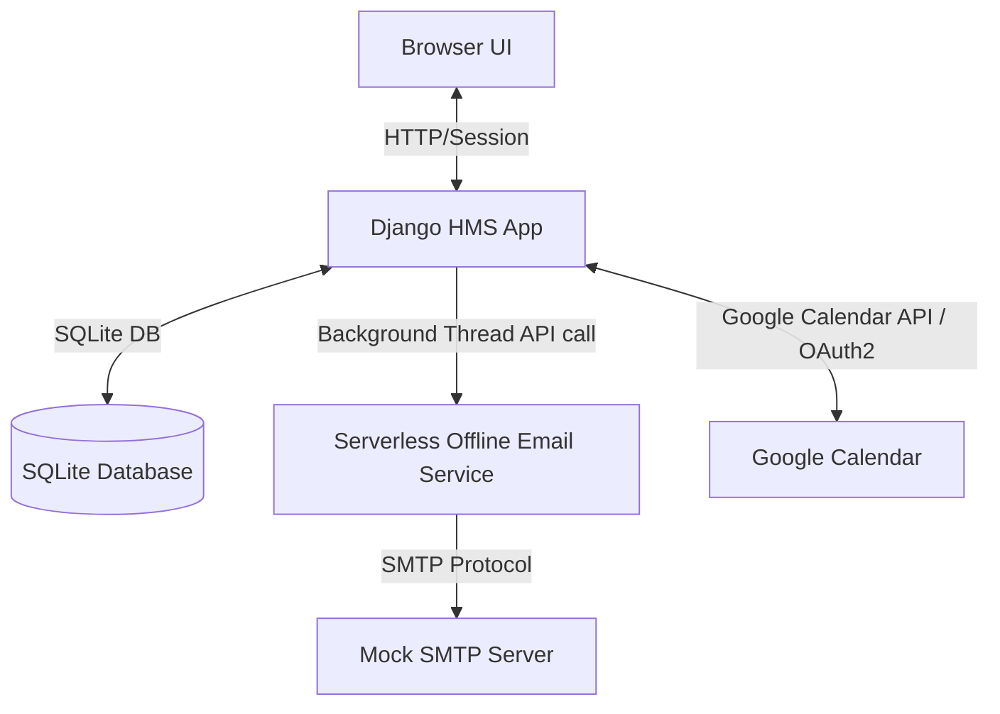

# Mini Hospital Management System (HMS)

Build of a locally runnable Mini Hospital Management System (HMS) focused on doctor availability scheduling, patient booking, Google Calendar syncing, and a serverless email notification service.

---

## Setup and Run

To run the complete system locally on a fresh machine, follow these step-by-step instructions:

### Prerequisites
- **Python**: Version 3.11 or later installed.
- **Node.js & npm**: Installed.

### 1. Workspace Configuration
1. Clone the repository and navigate into the root directory:
   ```bash
   cd Hospital_Management
   ```
2. Install Python dependencies:
   ```bash
   pip install -r requirements.txt
   ```
3. Create a `.env` file in the **root** folder containing the following environment variables (adjust if you have Google Cloud OAuth credentials, otherwise they can remain default/blank for Local Mode):
   ```env
   SECRET_KEY=django-insecure-key-hms-local
   DEBUG=True
   
   # Google Calendar Integration (Optional, falls back to Local logging Mode if empty)
   GOOGLE_CLIENT_ID=
   GOOGLE_CLIENT_SECRET=
   GOOGLE_REDIRECT_URI=http://localhost:8000/google/callback/
   
   # SMTP Configuration (Defaults to local mock SMTP server)
   SMTP_HOST=127.0.0.1
   SMTP_PORT=1025
   SMTP_USER=
   SMTP_PASSWORD=
   ```

### 2. Initialize Database
Navigate to the `hms` directory and run migrations:
```bash
cd hms
python manage.py migrate
```

### 3. Start Local Mock SMTP Server (Terminal 1)
From the repository root, start the SMTP server to catch and print outbound emails locally:
```bash
python scratch/smtp_server.py
```
*Note: This server listens on `127.0.0.1:1025` and prints sent email bodies directly to the terminal stdout.*

### 4. Start Serverless Email Service (Terminal 2)
Navigate to the `email-service` directory and run either the Serverless Framework or the standalone Python email server:

**Option A (Standalone Python Server - Recommended & Zero-Config):**
Since newer Serverless Framework versions require cloud account logins/keys, we provide a zero-dependency standalone Python web server that mimics the identical endpoint and logic:
```bash
cd email-service
python server.py
```

**Option B (Serverless Framework - requires Node/NPM):**
```bash
cd email-service
npm install
npx serverless offline
```
*Note: Whichever option you choose, the local endpoint will be exposed on `http://localhost:3000/dev/email`.*


### 5. Run Django Application (Terminal 3)
Navigate to the `hms` directory and start the Django development server:
```bash
cd hms
python manage.py runserver
```
Open your browser and navigate to `http://localhost:8000/`.

---

## System Architecture

The project consists of two independent services running locally:



### Django App & Serverless Connection
- Django connects to the Serverless Email Service via HTTP POST requests to `http://localhost:3000/dev/email`.
- To ensure optimal performance and responsive load times for the browser client, all API requests to the email service (and Google Calendar API) are handled in background daemon threads in Django (`threading.Thread`). This prevents external network latency from blocking the Django HTTP response.

### Data Model Decisions
- **UserProfile**: Holds the user role (`doctor` or `patient`) in a 1-to-1 relationship with Django's core `User` model.
- **AvailabilitySlot**: Stores availability ranges (start and end datetimes) created by doctors. Includes an `is_booked` boolean flag.
- **Booking**: Links a `patient` to a specific `AvailabilitySlot`.
- **GoogleCredentials**: Stores OAuth2 tokens (`access_token`, `refresh_token`, and token expiry dates) per user.

### Role-Based Access Enforcement
- Enforced using Django's `@login_required` decorators and custom checks at the start of each dashboard view:
  - If a user with role `patient` attempts to access `doctor_dashboard` or `add_availability`, they receive an `HttpResponseForbidden` (403).
  - If a user with role `doctor` attempts to access `patient_dashboard` or `book_appointment`, they receive an `HttpResponseForbidden` (403).

### Google Calendar Integration
- Built a custom OAuth2 integration using `google-auth-oauthlib`.
- When a user connects Google Calendar, they authorize the `'https://www.googleapis.com/auth/calendar.events'` scope. The app retrieves and stores the tokens in the `GoogleCredentials` model.
- When an appointment is booked, a background handler fetches the credentials for both Doctor and Patient, checks for token expiration, refreshes it using the stored `refresh_token` if needed, and uses `googleapiclient` to insert separate events with unique, personalized titles into each calendar.

---

## The Design Decision

### Named Problem: Handling Concurrent Slot Booking Race Conditions
When multiple patients attempt to book the exact same availability slot simultaneously, there is a risk of a race condition where the slot is double-booked.

### Options Considered

#### Option A: Application-Level Verification
Verify if the slot is free in Python (e.g. check `if not slot.is_booked`), and then issue a save command.
- **Pros**: Easy to write; database-agnostic.
- **Cons**: Severe race condition window. Under load or concurrent threads, multiple requests can read the slot status as `is_booked = False` before any of them write the booking. Consequently, both requests write a Booking object, causing a double-booked appointment.

#### Option B: Database-Level Row Locking via Transactions (`select_for_update`)
Wrap the booking confirmation in a database transaction block (`transaction.atomic()`) and query the target slot using `select_for_update()`.
- **Pros**: Bulletproof thread-safety. The RDBMS locks the specific slot row in the database during verification. Subsequent concurrent requests attempting to select or lock that row block until the first transaction commits or aborts. If the transaction completes, the second caller immediately reads the updated state (`is_booked = True`) and fails cleanly with a user error.
- **Cons**: Slightly increased database lock wait times during peak bookings.

### Selected Choice and Defense: Option B
We chose and implemented **Option B: Database-Level Row Locking**. 

Double-booking represents a critical failure in healthcare scheduling, leading to scheduling overlap and severe user frustration. In a scalable web application, application-level checks fail when running multiple worker processes (such as Gunicorn/Uwsgi) or horizontal server instances, as memory is not shared. Database row locking is the only architecturally sound approach that guarantees data consistency and prevents race conditions under high concurrency.

---

## Limitations

1. **Non-Persistent Background Worker (Threading)**:
   - *Issue*: Triggering calendar creation and email notifications via standard Python daemon threads means tasks are stored in memory. If the Django web server crashes or restarts, pending notifications or Google Calendar syncs are lost.
   - *Production Fix*: Integrate a persistent distributed task queue (e.g., **Celery** or **RQ**) backed by **Redis** or **RabbitMQ** to guarantee task execution and handle retries on network failures.
2. **Database Concurrency (SQLite)**:
   - *Issue*: While SQLite supports `select_for_update`, it locks the entire database file for writes rather than performing fine-grained row locks. This can lead to database write lock errors (`OperationalError: database table is locked`) under high concurrent traffic.
   - *Production Fix*: Deploy a dedicated relational database like **PostgreSQL** which natively supports robust row-level locks without blocking writes to unrelated tables.
3. **Google API Quotas and Expiry**:
   - *Issue*: In production, Google OAuth refresh tokens can expire after 6 months of inactivity or if the project has a testing status. If the refresh token expires, background calendar creation will fail silently for that user.
   - *Production Fix*: Implement proactive monitoring of token refresh failures, and display warning notifications to users on their dashboards requesting them to re-authenticate with Google if their token becomes invalid.
